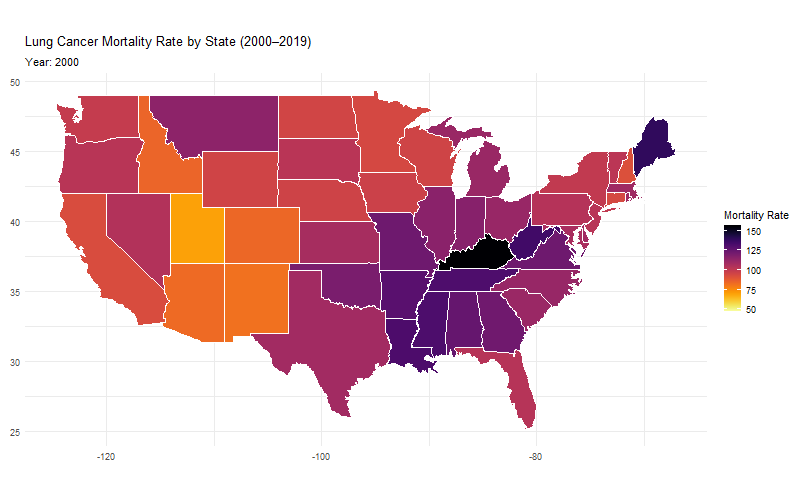

# Introduction

**Team Members**: Jasmine, Vasant, Chenglang

This notebook performs an exploratory data analysis (EDA) on lung cancer incidence data in the United States, covering the years **2000 to 2019**.  
The lung cancer mortality data were downloaded from **https://ghdx.healthdata.org/record/ihme-data/us-lung-cancer-county-race-ethnicity-2000-2019**, including all 50 U.S. states plus DC. “Mortality rate” refers to the age-adjusted number of deaths per 100,000 residents; these estimates were generated using population and deaths data from teh National Center for Health Statistics.

This analysis addresses the following questions:

1. Describe **temporal trends** in lung cancer mortality nationally.
2. Examine **demographic disparities** across **sex**, **age**, and **race**.
3. Identify **geographic variation** in lung cancer outcomes by **state**.

The data were sourced from multiple CSV files. After combining and cleaning them, we analyze the structure, summarize key variables, and visualize trends.

### Variable Descriptions

| **Variable Name** | **Description** |
|-------------------|-----------------|
| `year`            | Calendar year of the observation (2000–2019). |
| `state`        | U.S. state or jurisdiction where the mortality rate was recorded. |
| `sex`             | Biological sex of the population group (`Male`, `Female`). |
| `age_group`       | Age group category (e.g., `15–49 years`, `65+ years`). |
| `race`            | Racial or ethnic group (e.g., `White`, `Black or African American`). |
| `metric`          | Type of metric used for the mortality estimate. |
| `value`           | Age-adjusted lung cancer mortality rate (deaths per 100,000 population). |
| `lower_ci`        | Lower bound of the 95% confidence interval for the mortality rate. |
| `upper_ci`        | Upper bound of the 95% confidence interval for the mortality rate. |

### Research Interest

Our project focuses on trends in **lung cancer mortality** in the United States between **2000 and 2019**, with particular attention to **demographic disparities** and **state-level variation**. We use data from the **Institute for Health Metrics and Evaluation (IHME)**, which compiles cause-specific mortality estimates derived from population data and death certificates provided by the **National Center for Health Statistics (NCHS)**. These rates are **age-adjusted per 100,000 people**, allowing for meaningful comparisons over time and across population groups.

We chose to study lung cancer for the following reaons:

- **Leading cause of cancer death**: Lung cancer remains the most deadly form of cancer in the U.S., surpassing deaths from breast, prostate, and colorectal cancers combined.
- **Strong behavioral and environmental links**: Smoking remains the primary risk factor, but disparities in access to care, exposure to pollutants, and occupational risks also play a role.
- **Clear patterns across states and subgroups**: Lung cancer mortality shows variation by **sex**, **age**, **race/ethnicity**, and **geography**, making it a useful case for studying public health inequality and policy impacts.

Our research aims to understand how lung cancer mortality has changed over two decades and to identify the **subpopulations or regions most at risk**. In doing so, we hope to inform future public health strategies aimed at **reducing preventable deaths**, particularly in states or demographic groups that have not benefited equally from smoking cessation campaigns, early detection, or advances in treatment.


# Package Set Up
```{r message=FALSE, warning=FALSE}
library(tidyverse)
library(janitor)
library(skimr)
library(GGally)

```

# Data Preprocessing
```{r message=FALSE, warning=FALSE}
# Combining all yearly CSV files together (all csv file have the exact same data structure, varied by year)
male_files <- list.files("data/male", pattern = "\\.csv$", full.names = TRUE, ignore.case = TRUE)
female_files <- list.files("data/female", pattern = "\\.csv$", full.names = TRUE, ignore.case = TRUE)

male_data <- male_files %>%
  map_dfr(~ read_csv(.x) %>% clean_names()) %>%
  mutate(sex_name = "Male")

female_data <- female_files %>%
  map_dfr(~ read_csv(.x) %>% clean_names()) %>%
  mutate(sex_name = "Female")

lung_cancer_df <- bind_rows(male_data, female_data)
```

# Quick Overview
```{r}
glimpse(lung_cancer_df)
```

```{r}
# Clean and Structure Data
lung_clean <- lung_cancer_df %>%
  mutate(
    state = str_extract(location_name, "(?<=\\().+?(?=\\))"),
    state = if_else(is.na(state), location_name, state),
    
    # Normalize death rate per 100,000 population
    mortality_rate = val * 100000,
    lower_ci = lower * 100000,
    upper_ci = upper * 100000
  ) %>%
  select(
    year,
    state,
    sex = sex_name,
    age_group = age_name,
    race = race_name,
    mortality_rate,
    lower_ci,
    upper_ci
  ) %>%
  filter(!is.na(mortality_rate), state != "United States of America")

# Missing Values Check
colSums(is.na(lung_clean))
unique(lung_clean$state)
```

```{r}
# Preview of Cleaned Data
glimpse(lung_clean)
```

# National Trends Over Time
## 1. Overall Mortality Rate (2000-2019)
```{r}
nat_trend <- lung_clean %>%
  group_by(year) %>%
  summarize(mean_rate = mean(mortality_rate, na.rm = TRUE))

ggplot(nat_trend, aes(x = year, y = mean_rate)) +
  geom_line(color = "steelblue") +
  geom_point(color = "darkred") +
  labs(
    title = "National Lung Cancer Mortality Rate (2000–2019)",
    x = "Year",
    y = "Deaths per 100,000 (Age-adjusted)"
  )

```
 
 The national average lung cancer mortality rate decreased steadily from ~112 deaths per 100,000 in 2000 to ~82 deaths per 100,000 in 2019. This decline likely reflects reduced smoking prevalence, improved screening methods, and better treatments over the past two decades.

## 2. Mortality Trends By Sex
```{r}
sex_trend <- lung_clean %>%
  group_by(year, sex) %>%
  summarize(rate = mean(mortality_rate, na.rm = TRUE), .groups = "drop")

ggplot(sex_trend, aes(x = year, y = rate, color = sex)) +
  geom_line(linewidth = 1) +
  geom_point() +
  labs(
    title = "Lung Cancer Mortality by Sex (2000–2019)",
    x = "Year",
    y = "Deaths per 100,000",
    color = "Sex"
  )


```
  
  Males have consistently higher mortality rates compared to females, with rates falling from ~150 to ~100 deaths per 100,000.Females saw a much slower decline, with their curve flattening between 2005 and 2010. This may suggest that tobacco cessation and health campaigns initially targeted men more effectively or that historical smoking rates among women lagged behind men.


## 3. Mortality Trends By Age Group
```{r}
age_trend <- lung_clean %>%
  group_by(year, age_group) %>%
  summarize(mean_rate = mean(mortality_rate, na.rm = TRUE), .groups = "drop")

ggplot(age_trend, aes(x = year, y = mean_rate, color = age_group)) +
  geom_line() +
  labs(
    title = "Lung Cancer Mortality by Age Group",
    x = "Year",
    y = "Deaths per 100,000",
    color = "Age Group"
  ) +
  theme(legend.position = "bottom")


```
Older groups show much higher mortality, exceeding 400 deaths per 100,000. Younger age groups (<50 years) maintain low and nearly flat rates, indicating that lung cancer remains predominantly an illness affecting older adults. The decline in older age groups suggests improvements in screening and treatment for seniors, as well as the cumulative effect of reduced smoking over time.

## 4. State_Level Mortality During Two Decades
```{r}
# cannot render the images inside r markdown so i run this in r console and the code shown below is how gif generated
# install.packages("gganimate")
# install.packages("gifski")
# install.packages("viridis") 
# install.packages("maps")
# install.packages("tidyverse")
# 
# 
# library(tidyverse)
# library(gganimate)
# library(gifski)
# library(maps)
# library(viridis)
# 
#  1. Prepare state map
# us_states <- map_data("state")
# 
#  2.  get valid state names from the map
# valid_states <- unique(us_states$region)
# 
#  3. prepare the state name
# lung_anim <- lung_clean %>%
#   mutate(state_lower = tolower(state)) %>%
#   filter(state_lower %in% valid_states) %>%
#   group_by(year, state_lower) %>%
#   summarize(rate = mean(mortality_rate, na.rm = TRUE), .groups = "drop")
# 
#  4. join map data with lung data
# map_data_yearly <- left_join(us_states, lung_anim, by = c("region" = "state_lower"))
# 
#  5. animated map
# p <- ggplot(map_data_yearly, aes(x = long, y = lat, group = group, fill = rate)) +
#   geom_polygon(color = "white") +
#   coord_fixed(1.3) +
#   scale_fill_viridis(name = "Mortality Rate", option = "inferno", direction = -1) +
#   theme_minimal() +
#   labs(
#     title = "Lung Cancer Mortality Rate by State (2000–2019)",
#     subtitle = "Year: {frame_time}",
#     x = NULL, y = NULL
#   ) +
#   transition_time(year) +
#   ease_aes("linear")
# 
#
# anim <- animate(p, nframes = 100, fps = 5, width = 800, height = 500, renderer = gifski_renderer())
# anim_save("lung_mortality.gif", animation = anim)

```


```{r}
state_2019 <- lung_clean %>%
  filter(year == 2000) %>%
  group_by(state) %>%
  summarize(rate = mean(mortality_rate, na.rm = TRUE), .groups = "drop") %>%
  arrange(desc(rate))

ggplot(state_2019, aes(x = reorder(state, rate), y = rate)) +
  geom_col(fill = "firebrick") +
  coord_flip() +
  labs(
    title = "Lung Cancer Mortality by State (2000)",
    x = "State",
    y = "Deaths per 100,000"
  )
```

  
```{r}
state_2019 <- lung_clean %>%
  filter(year == 2010) %>%
  group_by(state) %>%
  summarize(rate = mean(mortality_rate, na.rm = TRUE), .groups = "drop") %>%
  arrange(desc(rate))

ggplot(state_2019, aes(x = reorder(state, rate), y = rate)) +
  geom_col(fill = "firebrick") +
  coord_flip() +
  labs(
    title = "Lung Cancer Mortality by State (2019)",
    x = "State",
    y = "Deaths per 100,000"
  )
```
  Kentucky, West Virginia, Maine ,and Mississippi are among the states with the highest mortality rates (>120 deaths per 100,000). These states historically have high smoking prevalence and potentially limited access to healthcare. Utah and Colorado show the lowest rates, likely due to lower smoking rates and stronger public health measures. The sharp contrast between states underscores the impact of local health policies and cultural habits.


```{r}
race_trend <- lung_clean %>%
  filter(!is.na(race), race != "All Races") %>%
  group_by(year, race) %>%
  summarize(mean_rate = mean(mortality_rate, na.rm = TRUE), .groups = "drop")

ggplot(race_trend, aes(x = year, y = mean_rate, color = race)) +
  geom_line(size = 1.2) +
  labs(
    title = "Lung Cancer Mortality Trends by Race Group",
    x = "Year",
    y = "Deaths per 100,000",
    color = "Race Group"
  ) +
  theme_minimal() +
  theme(
    legend.position = "bottom",
    plot.title = element_text(face = "bold", size = 14),
    axis.title = element_text(size = 12)
  )
```
American Indian and Alaska Native groups have the highest lung cancer mortality rates, which increased between 2000 and 2005 before declining. Black populations started with the highest rate in 2000 but achieved significant reductions, approaching parity with other races by 2019. Asian populations show relatively stable, low mortality, possibly due to lower historical smoking prevalence.


  While all race groups exhibited a downward trend in lung cancer mortality over the study period, the Asian population in particular showed a relatively stagnant rate between 2000 and 2015. The American Indian and Alaska Native (AIAN) group experienced an increase in mortality rates from 2000 to 2005, followed by a steady decline; however, they consistently maintained the highest mortality rate among all race groups from 2005 to 2019. The Black population started with the highest mortality rate in 2000 but demonstrated the greatest improvement, with a consistent decrease throughout the period.
